# End-effector Computing

## Yiren (Ramon) Qu, Rosario Scalise

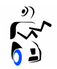 

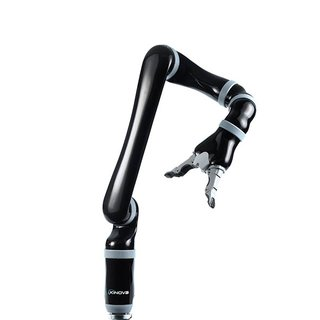

---

# Table of Contents

1.  [What you'll need](#org11f013c)
2.  [Mechanical](#org437c511)
    1.  [Printing the 3D files](#orgf55114f)
    2.  [Mounting the enclosure to the robot arm](#org37ac3e7)
    3.  [Fitting the hardware to the 3D enclosure](#org6f79684)
    4.  [Thermal mitigation](#org3c07fc7)
3.  [Electrical](#org4b2b1a1)
    1.  [Recommended power source](#org7981dc9)
    2.  [Fabricating the cables](#org4e38be8)
    3.  [Connecting the cables](#org54e2305)
    4.  [Cable summary](#orgdba8e15)
4.  [Software](#org84be803)
    1.  [Installing the OS to the Joule](#orgcbfb208)
    2.  [Installing Required Libraries](#org4290339)
5.  [Recommended Networking Configuration](#orgea01b4a)
    1.  [Client-side (off-board computing) Networking](#org06cd64d)
    2.  [Server-side (end-effector computing) Networking](#orgc67814a)
    3.  [ROS](#orge867589)
6.  [Running](#orgdd11d53)

# What you'll need
> See [Appendix](orgdrr23431) for an itemized list with purchase links (updated as of June 2018).
1.  Intel Joule 570X Developer Kit (or comparable board)

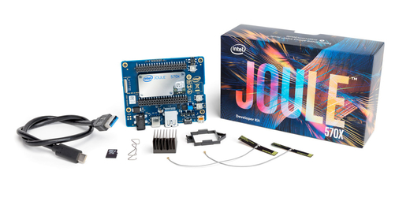

2.  Intel RealSense D415 or D435 RGBD Camera (or openni2 support RGBD cameras)

    2.1 USB type C to A 3.0 cable
    
    > You may use the cable included with the Joule, or order a shorter one.

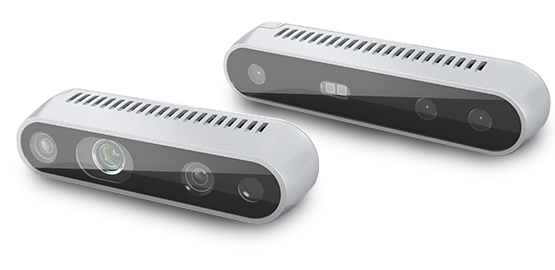

3.  3D Printed Parts 
    > Models and printed object can be found in the [3D File section](#orgf55114f)

    3.1 Intel Joule enclosure body

    3.2 Intel Joule Box Flat enclosure Top

    3.3 Intel Joule Box Incline enclosure Top

    3.4 Mount cuff connector
4.  Pololu 12V, 2.2A Step Down. (Voltage Regulator D24V22F12)
5.  Screws:

    5.1 M2 X 8 Screw

    5.2 M3 X 6mm Screw

    5.3 M3 X 10mm Screw

    5.4 M? X ? Screw (for incline top camera)

6. Flat Flex, Ribbon Jumper Cables (20 pins 2.000" (50.80mm)) Molex, LLC 0152670357

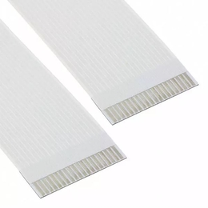

7. DC jack for Joule power source (you can "borrow" one from most standard wall-wart style adapters).

8. Active Cooling System for Intel Joule Module

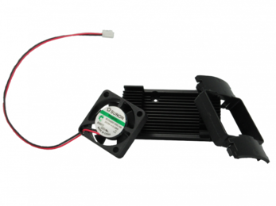

9. Optional based upon resources, but we used the Kinova Jaco 7-DOF manipulator (you could also use your own robot and modify the 'cuff mount')

10. Wi-Fi Router. We are using TP Link AC1900.

# 🔧 Mechanical

## Printing the 3D files

-   Here are the [3D Print-ready files](./3d_model/) for the Intel Joule housing box and mount with the end-effector.

[Intel Joule enclosure body](./3d_model/enclosure_final.STL)

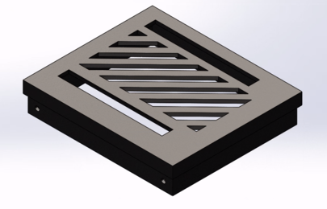

[Intel Joule box flat enclosure top](./3d_model/Top_regular.STL)

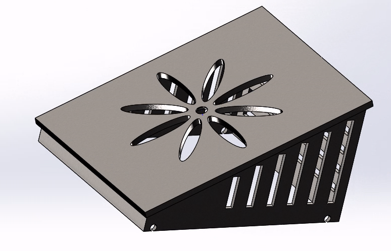

[Intel Joule box incline enclosure top ](./3d_model/Top_incline.STL)
> Note: The incline top is to allow for mounting the camera further back and altering its view angle.

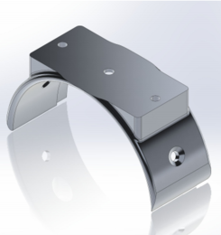

[Mount cuff connector](./3d_model/ring_final.STL)

Assembly look with flat case top:

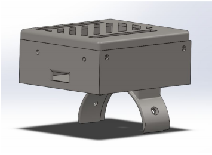

Assembly look with incline case top:

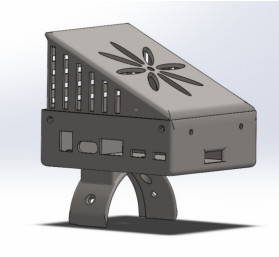

### Print Settings

- We used Solidworks to design and test assembly fit for each part.
- We printed the model with [Ultimaker 2+](https://ultimaker.com/) and [Creator Pro](http://www.flashforge.com/creator-pro-3d-printer/). The settings used are listed below:
    - Layer height: 0.1 mm
    - Infill Percentage: 50%
    - Temperature: 225°C

> - Alternatively, [Shapeways](www.shapeways.com) supplies high quality 3D print services.

- The final printed models:

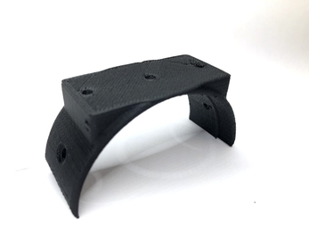

Mount cuff connector

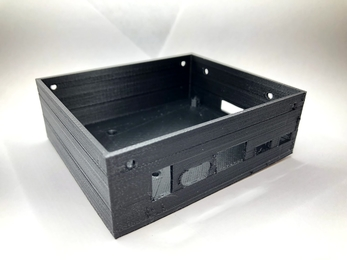

Intel Joule enclosure body

Intel Joule box flat enclosure top

Intel Joule box incline enclosure top

## Mounting the enclosure to the robot arm

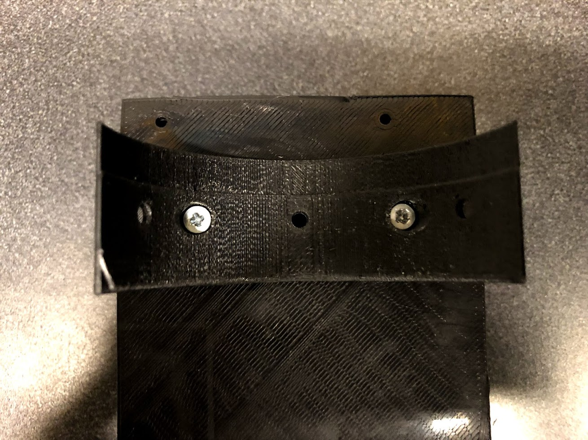

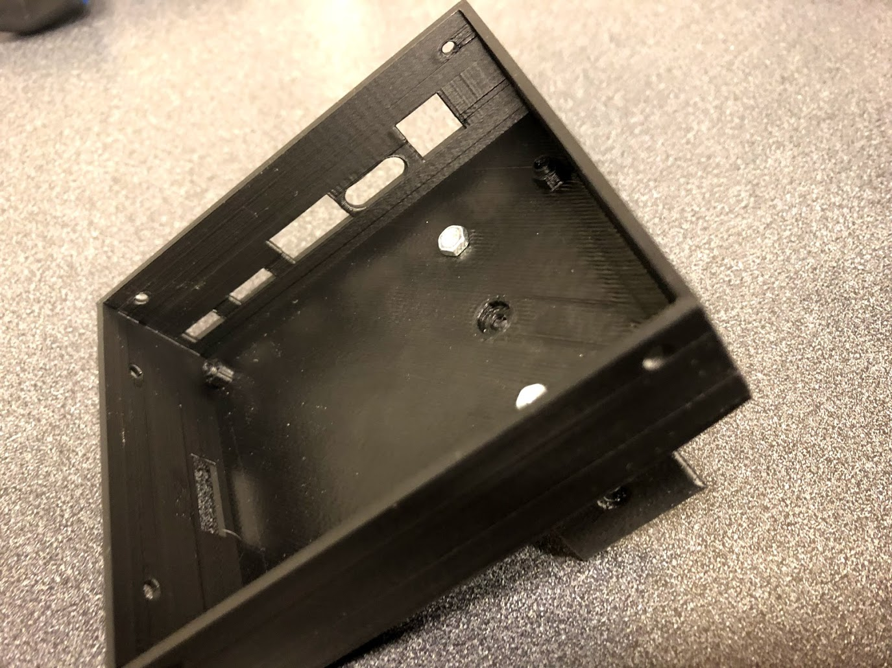

1. Connect the enclosure body [#3.1] and the end-effector cuff connector [#3.4] with 2X screws [#5.3]

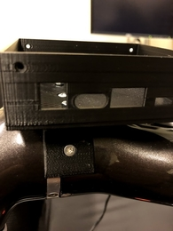

2. Unscrew the Kinova Jaco's last joint's top three screws. And directly secure the assembled parts (enclosure body + cuff connector) to the arm with 3X screw [#5.3]

## Fitting the hardware to the 3D enclosure

### Insert the Joule into the enclosure

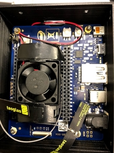

-  Secure the Intel Joule board [#1] into the enclosure with 4 X Screws [#5.1].

> Please make sure the two wifi antenna would not touch each other and able to be fit in the enclosure.

### Attach camera to the enclosure

Camera Mount 1

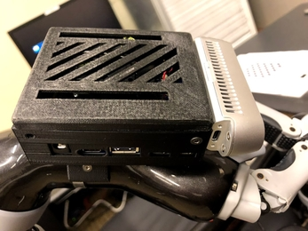

Camera Mount 2

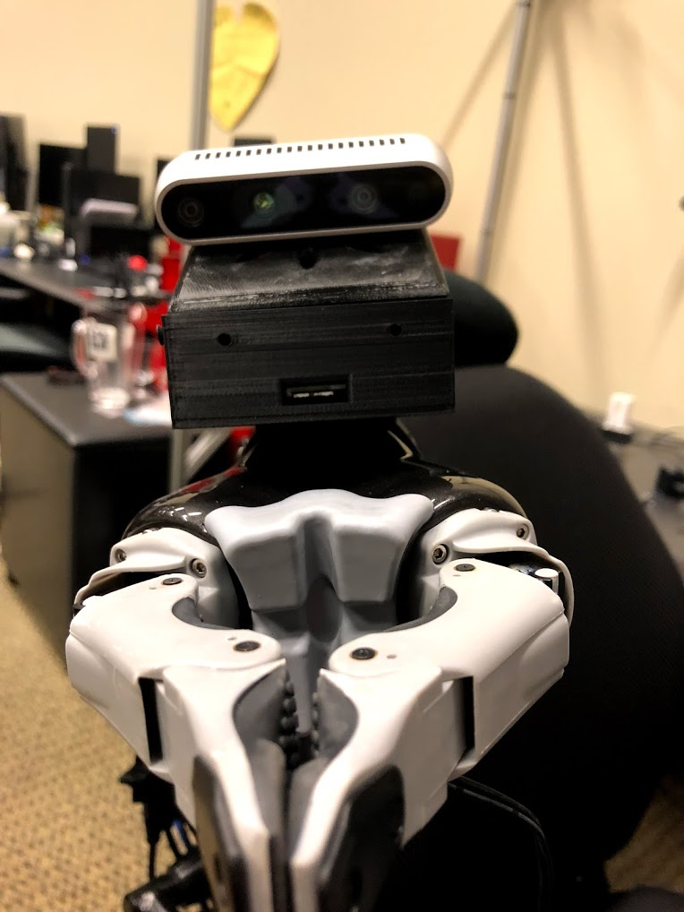

1. Install flat front camera mount:

    5.1 Mount the Intel RealSense camera with 2 X screw [#5.2]. 

    > Make sure the camera is securely mounted with the enclosure, which would not resulting much vibration when the end effector's moving

    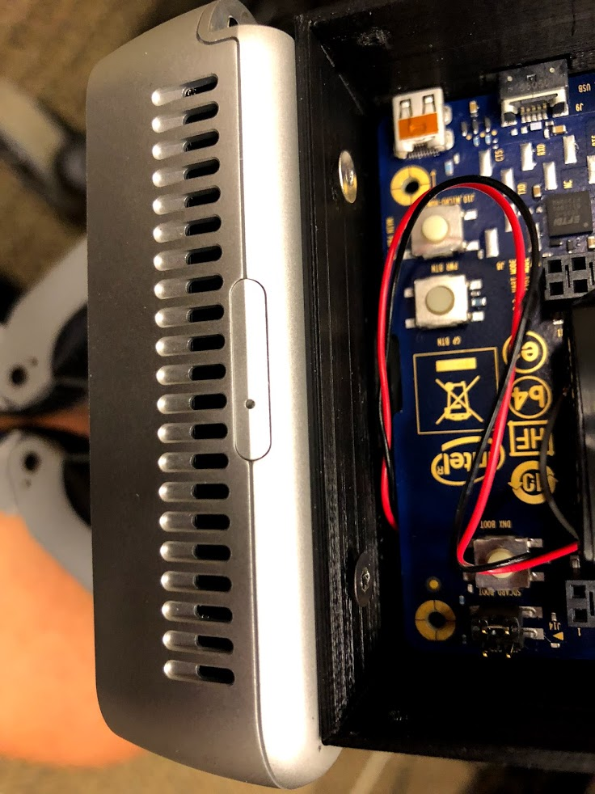

    5.2 Connect camera and the Intel Joule with USB type C to A 3.0 cable [#2.1]

    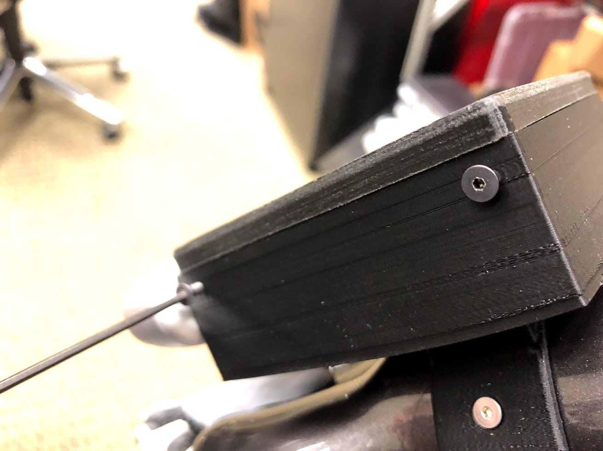

    5.3 Secure the flat enclosure top with 4X screws [#5.2]

2. (Optional) Install incline camera mount:

    6.1 Secure the incline enclosure top with 4X screws [#5.2]

    6.2 Mount the camera on the enclosure with 1X screws [#5.4].

    > Make sure the camera is securely mounted with the enclosure, which would not resulting much vibration when the end effector's moving

    6.3 Connect camera and the Intel Joule with USB type C to A 3.0 cable [#2.1]

## Thermal mitigation

Parts[#8]

-   

You may purchase the part from this [site](https://store.gumstix.com/fansink-intel.html). 

The problem we encoutered was that the Joule would automatically shutdown due to the high temperatures. The passive cooling option is not a sufficient cooling option when the camera is running. With active cooling, we were able to run the camera at full FPS indefinitely without issue.

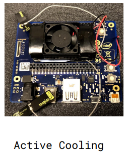

> When installing this module, you need to take off the four screws which directly on the CPU module. Please remove them carefully and screw them securely with the active cooling module. And please use the thermal paste sticker when connect the heat sink with the CPU. 

# ⚡️ Electrical

## 🔌 Recommended power source

-   Intel Joule with Intel RealSense D435 running requires ≥ 1.5A @ 12V
> ❗️Intel joule only requires ~0.6A @ 12V to boot.
-   Kinova Mico Joint 6 supplies max 3A @ 24V
-   Inside the hand, there is limited space to store the power conversion circuit. We use buck convertor from Pololu [#4] to convert the power from Kinova arm to supply intel Joule. 

## Fabricating the cables

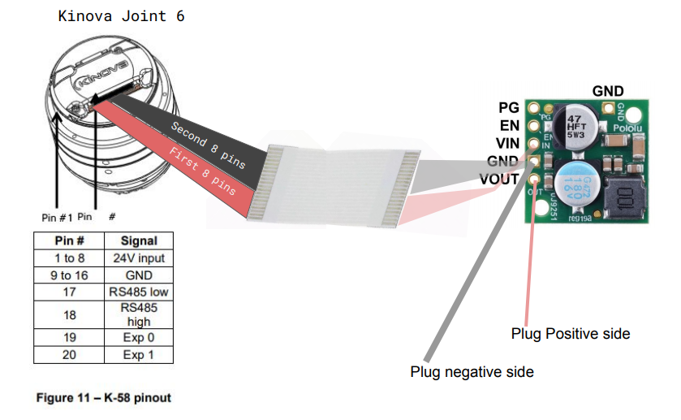

-  The electronic schematic diagram of the power system. 

## Connecting the cables

-   The final connected cable

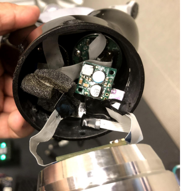

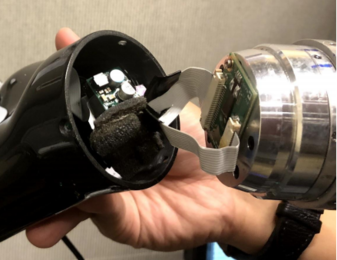

 We drilled a hole from the hand for the DC jack to go through. 

 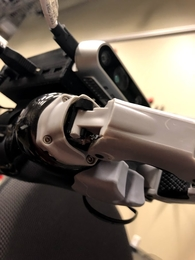

-  Plugging into board

## Cable summary

-   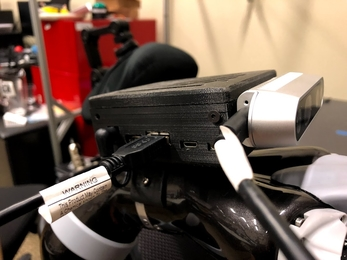

# Software

## Installing the OS to the Joule

- Please check [this post](./Intel-Joule-Setup.md) to install the OS onto the Intel Joule.
- In my project, I used Lubuntu (Ubuntu/Linux core 16.03 LTS) with ROS-Desktop version installed. 

## Installing Required Libraries

- [ROS required packages (with minor modifications)](https://github.com/ramonidea/prl_wireless_perception.git)

    - [ROS Image Transport Plugins](https://github.com/ros-perception/image_transport_plugins.git)

    We used Compressed Image Transport Plugins to compressed the RGB Images. 

    - [ROS Image Pipeline](https://github.com/ros-perception/image_pipeline.git)

    We used one function `point_cloud_xyzrgb` inside the `depth_image_proc` to reconstruct the point cloud data from RGB and Depth images.

    > And their dependency packages `image_common` and `image_geometry`

    - [RGBD_Message](https://github.com/ramonidea/prl_wireless_perception/tree/master/rgbd_message)
        
        This is a custom package trying to solve the problem that depth and color images are not arriving at the same time. This send a message with serialized rgb and depth image data. And we used JPEG lossy compression on Color and lossless compression on Depth.

- [Realsense Camera Driver](https://github.com/IntelRealSense/librealsense)

    Please follow the [README document](https://github.com/IntelRealSense/librealsense/blob/master/readme.md) to install the driver.

- [RealSense Camera ROS Wrapper](https://github.com/intel-ros/realsense)

    Please build this after installing the driver.

> If you are using Intel Realsense R435, you may need to change the parameter to 

> #TODO: copy code to here

## Networking Diagram

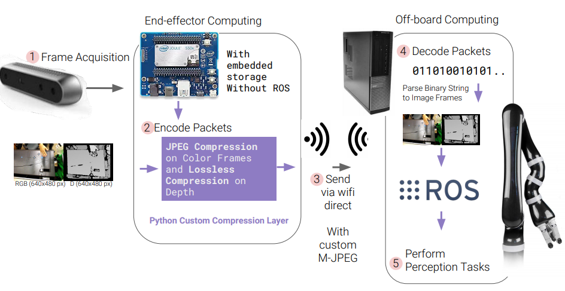

Option 1

This option is mainly rely on Python codec and ROS realsense wrapper. It compresses RGB and Depth into one serialized array topic with custom message type: `/camera/rgbd`. And the client side run the decompress methods to separate the one topic into two topics: `/camera/color/decompressed` and `/camera/depth/decompressed`, or it may use the decompression pacakge, which you can call the decompress function in your client side and decompress into two frames without republishing.

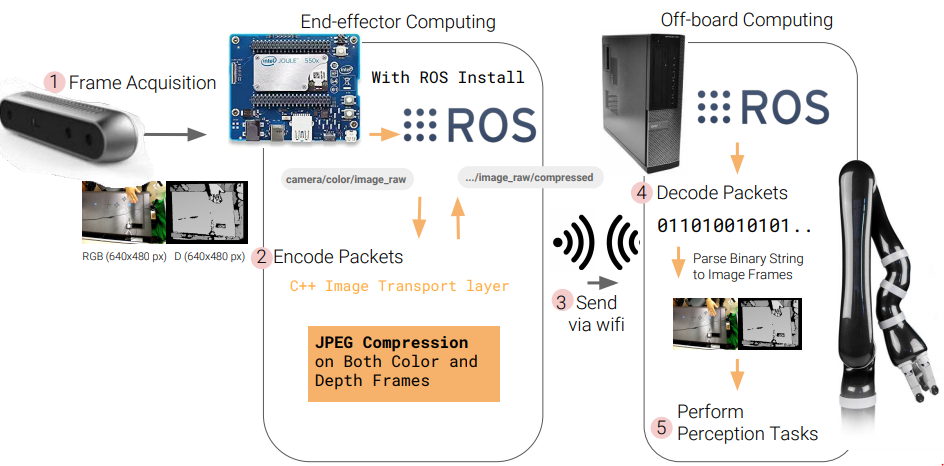

Option 2

This option is mainly rely on C++ and ROS realsense wrapper. It compresses RGB and Depth image separately into two topics: `/camera/color/image_raw/compressed` and `/camera/depth/image_raw/compressedDepth`. And the client side may use `Message_filter` to synchronize those two topics. 

# Recommended Networking Configuration

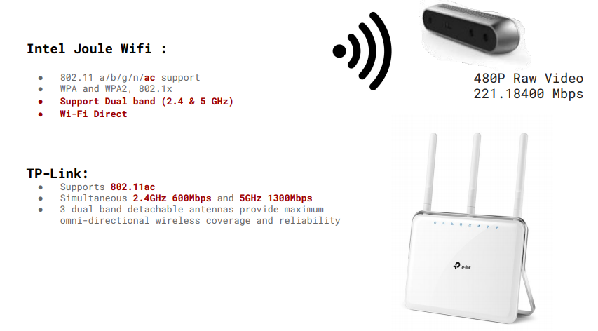

## Client-side (off-board computing) Networking

-   We are currently using [#10] TP-Link Router. 
-   We set the static IP addresses for both the client side and the server side. 

> For example, you may set the client side to be static as 192.168.2.171. And the joule be 192.168.2.176.

We will run the roscore on the client side. 

## Server-side (end-effector computing) Networking

-   Because we run the rerscore on the client side, please use command to set `ROS_MASTER_URI` and `ROS_IP` on each machine.

## ROS

-   use command `ifconfig` to retrieve the IP address from your workstation. 

> The ip addresses should be always the same, because we save the ip address in the router setting from the last step.

-  Please make sure the Joule's `ROS_MASTER_URI` has been set to that ip address. And set the `ROS_IP` correctly. 

    As an example, if your workstation (ip address `192.168.1.10`) running `roscore` has a wireless adapter IP of `192.168.1.12`, then make sure your terminal running the ROS environment has its `ROS_MASTER_URI` pointed to the workstation like so: `export ROS_MASTER_URI=http://192.168.1.10:11311` and set joule ip address with command: `export ROS_IP=192.168.1.12`

# Running

-   Please refer to the ADA-Joule demo described in this [document](Intel-Joule-ADA-Perception-Demo.md).

# Appendix

## Bill of Material

|                   Part Name                   | Num of Part |    Price   | Purchase Link |
|:---------------------------------------------:|:-----------:|:----------:|:----------:|
|         Intel Joule 570x Developer Kit        |      1      |   $585.00  |   ???   |
|             Intel Real Sense D435             |      1      |   $179.00  |  https://click.intel.com/intelr-realsensetm-depth-camera-d435.html    |
|             3D PLA 1.75mm Filement            |  1kg Spool  |   $20.00   |  https://www.amazon.com/HATCHBOX-3D-Filament-Dimensional-Accuracy/dp/B00J0ECR5I/ref=sr_1_2?ie=UTF8&qid=1530140364&sr=8-2&keywords=pla%2B1.75mm%2Bblack&th=1    |
|                  Kinova Robot                 |      1      | $40,000.00 |  https://www.kinovarobotics.com/en/products/robotic-arm-series    |
|           Intel Joule Box (3d print)          |      1      |    Free    |  --    |
|             Wrist Mount(3d print)             |      1      |    Free    |  --    |
|                   M3 X 10 Screws                  |     6     |    ???        |    ???  |
|                   M3 X 6 Screws                   |     5     |     ???       |   ???   |
|                   M3 Washer       |   2 (optional) for the camera  |    ???    |  ???    |
|                   M2 X 8 Screws                   |     4     |    ???     |  ???    |
|              Active cooling parts             |      1      |    $32        |  https://store.gumstix.com/fansink-intel.html    |
| Pololu 12v 2.2A step down regulator D22V22F12 |      1      |    $9.95        |  https://www.pololu.com/product/2855    |
| Wi-Fi Router. We are using TP Link AC1900     |      1      |   $89.99         |  http://a.co/hMIWrfC   |