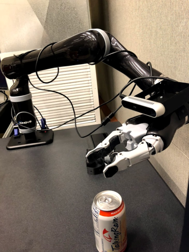

# Why Wireless Perception with End-Effectors

## Reason 1: Tangling Wires
- Tangling external wires is always a problem of using end-effectors to do tasks. 
 

Like the pictures showing above, Assistive Dextrous Arm (ADA), the end-effector we are using in the lab, is tangled by the USB cable which connects from camera to the host machine. 

- And in some real lab test demos, wired solution affected the end-effector's kinematics range.
For example, if ADA is trying to feed the noodles for the users, the last joint has to rotate 360 degrees many times which broke the USB cables.

## Reason 2: Internal wired solution is not enough for high volume data

- In ADA, the internal design does not have pass throughs for cables. The only pins we are able to use are the 4 pins showing in the image above, which cannot supply enought bandwidth to support the live video streams. If we are using resolution 640*480 at 30 Frame per second speed, we need at least...... bandwidth to transmit the data.
- The extension data pins are next to the power pins, which may have crosstalks between the power pins and the data pins, causing severe signal loss.
- Through the long body, the signal of the data would suffer from signal digradation.
- Those interference the data continuity of the required data.

## Reason 3: Co-deploy with the End-effector

- The ADA is able to be mounted onto a wheelchair to assist user. And in that case, we do not need to deploy and set up environmental cameras around the subject. The wireless perception would share the power source with the end-effector. 

## Reason 4: Enable POV Servoing